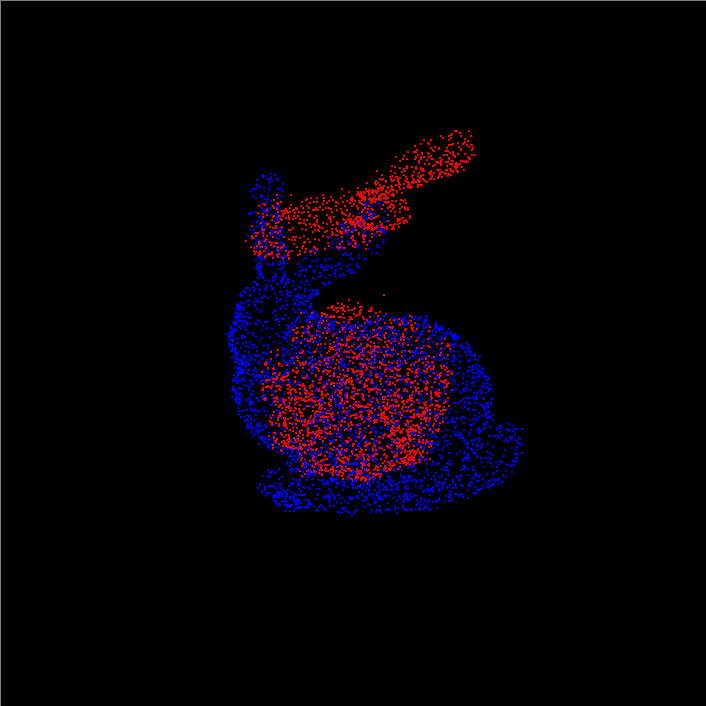
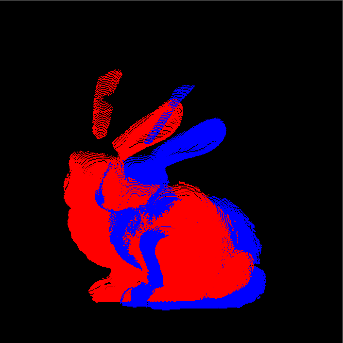

# Fast Globally Optimal ICP - A CUDA Implementation of [Go-ICP](https://github.com/yangjiaolong/Go-ICP)

**University of Pennsylvania, CIS 5650: GPU Programming and Architecture, Final Project**

* **Authors**: Mufeng Xu & Zhaojin Sun
* Tested on:
  * Windows 11, i9-13900H @ 2.6GHz 32GB, RTX 4080 Laptop 12GB (Personal Computer)
  * Windows 11, i9- @ ...GHz 64GB, RTX 4090 Laptop 16GB (Personal Computer)

## Introduction

This project implements CUDA acceleration for ICP: the classic point cloud registration algorithm, and its globally optimal improvement, Go-ICP. The project also provides tools for visualization and performance measurement.

## Demo
Here is a demo that compares the speed of original Go-ICP paper and our method.
<div style="display: flex; justify-content: space-around;">
  
  
</div>

### How to build and run the code
**Step 1: Hardware Setup**
- Any modern CPU and an operating system of any modern distribution should be compatible with this project.
- You must have a GPU that supports CUDA version 12.6 or higher. CUDA version 11.8 is not sufficient. Here is the [list of CUDA-compatible GPUs](https://developer.nvidia.com/cuda-gpus) along with their compute capabilities. For instructions on installing the CUDA Toolkit, you can refer to the following website: [Cuda installation Guide](https://docs.nvidia.com/cuda/index.html).

**Step 2: Software Setup**
- You will need a version of CMake that supports the C++17 standard to configure the project.
- For Windows users, it is recommended to use Visual Studio 2019 or newer version and `x64` for your platform, as we do not include Win32 libraries. You can configure the project using either CMake's GUI or console commands.
- If you are on a Linux system, execute the following commands in the root directory:
```
mkdir build
cd build
cmake ..
make -j8
```
- The project uses OpenGL to provide visualization. In the `/external` folder located in the root directory, we have already included Windows binaries and headers for GLEW and GLFW. For Linux systems, ensure that the right libraries (dev versions) are installed for mesa and glx for your distribution.

**Step 3: Run the demo**
- The configuration `.toml` files are located in the `/test` folder in the root directory. Pass the file path as an argument to specify the configuration target. For example:
```./bin/cis5650_fgo_icp ../test/bunny.toml``` If you are using Visual Studio, make sure the corresponding path is added to the **Command Arguments** in the project configuration.
- Point cloud data (source: [The Stanford 3D Scanning Repository
](https://graphics.stanford.edu/data/3Dscanrep/), [Artec 3D](https://www.artec3d.com/3d-models/ply) and original paper) is stored in the `/data` folder in the root directory. Currently, the project supports two file formats: `.txt` and `.ply`. For the internal format, please refer to the point cloud files we have provided. Here is an [online viewer for `.ply` files](https://imagetostl.com/view-ply-online). 
- We have also provided a Python script: `transform_point_cloud.py` for you to generate data point clouds from existing ones.

## Algorithm
If you're interested in the details of the ICP and Go-ICP algorithms, you can refer to [this document](Algorithm.md).

### Comparison between ICP and Go-ICP
- Convergence
  - ICP converges to a local minimum, highly dependent on initial alignment and prone to suboptimal results if the initial guess is poor.
  - Go-ICP guarantees global convergence through a branch-and-bound framework, ensuring the optimal solution regardless of initial alignment.
  - **An example of ICP converging to local minima**

<div style="display: flex; justify-content: space-around;">
  
</div>


- Performance:
  - ICP is faster for well-aligned point clouds due to its simplicity and focus on local optimization.
  - Go-ICP is slower because it exhaustively searches both rotation and translation spaces but ensures the best possible result.
- Robustness:
  - Both ICP and Go-ICP are sensitive to noise and outliers, which can lead to poor results in challenging scenarios.


## Acceleration

### Accelerating ICP
**Sample point clouds in advance**
- During the point cloud loading phase, you can choose to sample the point cloud at a specific ratio: `subsample` in the `.toml` configuration file. This significantly improves processing speed. Since the current sampling method is entirely uniform, it generally does not lead to the ICP converging to another position compared to ICP without sampling.
- **A demo before and after sampling with ratio 0.05**
<div style="display: flex; justify-content: space-around;">
  
  
</div>

**Parallelization of Procrustes Method**
- For each point in the point cloud, we utilize a CUDA kernel for parallelization. Specifically, this includes: applying mean centering to the point cloud, computing the covariance (i.e., outer product), and applying the $SE(3)$ homogeneous transformation to the point cloud.
- To accelerate all summation operations, we use thrust::reduce. This specifically includes calculating the mean of the point cloud and obtaining the covariance matrix from the covariance computation.
- **A demo of our ICP vs our CUDA-accelerated ICP**

<div style="display: flex; justify-content: space-around;">
  
  
</div>

**Find Closest Points with k-d Tree**
- A k-d tree is a binary search tree for organizing points in k-dimensional space, optimized for tasks like nearest neighbor search and range queries. To use it, first build the tree by recursively splitting points along one dimension at a time (e.g., x, y, z) based on median values. For nearest neighbor queries, traverse the tree by comparing the query point with node split dimensions, prune regions that can't contain closer points, and backtrack as needed. This is a very brief introduction. For more information, you can read the [Wikipedia page on k-d trees](https://en.wikipedia.org/wiki/K-d_tree).


- We integrated the k-d tree from the nanoflann library to accelerate nearest neighbor searches in the point cloud. However, for smaller point clouds, our tests revealed that the k-d tree is not faster than naive iteration.

### Accelerating Go-ICP
**Terminate Early**
- In the original paper, the termination condition for the search is that the lower bounds of all remaining search spaces exceed the current best error. However, in practice, we observed that the point cloud often converges to the correct alignment much earlier, but a significant amount of time is still wasted exploring potentially better parameters. To address this, we introduced an error threshold to terminate the search early.
- **Performance gain by terminating early**

<div style="display: flex; justify-content: space-around;">
  
  
</div>

**Flattened k-d Tree on GPU**
- To improve the speed of the k-d tree, we attempted to flatten the k-d tree structure and store it in the GPU's memory. However, we found that this approach not only failed to enhance performance but actually made subsequent attempts to parallelize Go-ICP even slower (as shown in the speed comparison below)! We suspect this is due to the memory discontinuity introduced by flattening, along with some peculiar issues related to Thrust.

- In conclusion, we ultimately confirmed that k-d trees are not suitable for CUDA and GPU acceleration. Except for the CPU mode of Go-ICP and one mode of ICP on GPU, all remaining k-d Tree implementations have been removed and replaced with faster alternatives such as Lookup Tables or straightforward brute-force search.

**Lookup Table (LUT) on GPU**

A Lookup Table (LUT) is a data structure that precomputes and stores the results of computationally expensive operations, enabling rapid retrieval during runtime. In our application, we construct a 3D LUT to store squared distances to the nearest point in the target point cloud.

* Efficient Storage: The LUT is stored as a CUDA Texture Object, which allows for efficient lookups due to optimized memory access patterns.
* Parallel Construction: The LUT is built in parallel on the GPU, offering significantly faster performance compared to CPU-based construction, even with higher resolution.

This approach leverages the computational power of GPUs to enhance the speed and efficiency of nearest neighbor searches in 3D point clouds.

**Parallelization of Translation search**

In our search algorithm, the outer branch-and-bound searches the rotation space, while the inner branch-and-bound searches the translation space. For each given rotation and translation, we need to compute the the summed registration error of all source points, we parallellized the computation of the error, and use a `reduce` kernel to sum the errors up. Furthurmore, to fully utilize the computation resource, we launch several CUDA streams to compute for multiple translations simultaneously.

**Search Heuristics**

The Go-ICP algorithm employs a "greedy" depth-first search (DFS) approach, executing the Iterative Closest Point (ICP) algorithm only on cubes with an upper bound better than the current best error. Although cubes with a worse upper bound are still subdivided and searched, this process can significantly slow down the search. To address this issue, we relaxed the best error threshold, allowing cubes with an upper bound that is worse but close to the best error to also be evaluated instantly using ICP. This adjustment has substantially reduced the time required to find the global optimum.

## Documents

* [Project Pitch](https://docs.google.com/presentation/d/1C-O1aW140KLWjQmc2-Herpnuvxj0jVhFegk7Wi3SRPE/edit?usp=sharing)
* [MileStone 1](https://docs.google.com/presentation/d/1omXs0hrGCtUbaen9Aixj6ABXnqk9bh0E/edit?usp=sharing&ouid=103277975545706791648&rtpof=true&sd=true)
* [MileStone 2](https://docs.google.com/presentation/d/1-inPdKvwNXgdPIlzqkRgooJCiWQup2cT/edit?usp=sharing&ouid=103277975545706791648&rtpof=true&sd=true)
* [MileStone 3](https://docs.google.com/presentation/d/1oY2VQwpmYA-PWgP9vnW5Jk9unKl88eXV/edit?usp=sharing&ouid=103277975545706791648&rtpof=true&sd=true)
* [Final Presentation](https://docs.google.com/presentation/d/1oY2VQwpmYA-PWgP9vnW5Jk9unKl88eXV/edit?usp=sharing&ouid=103277975545706791648&rtpof=true&sd=true)

## Dependencies

* [OpenGL Mathematics (GLM)](https://glm.g-truc.net/0.9.4/api/index.html)
* [Eigen 3](https://eigen.tuxfamily.org/index.php?title=Main_Page)
* [TOML++](https://github.com/marzer/tomlplusplus)
* [tinyply](https://github.com/ddiakopoulos/tinyply)
* [nanoflann](https://github.com/jlblancoc/nanoflann)
  
We've included `TOML++`, `tinyply`, and `nanoflann` in our repo. You can install `glm` and `Eigen` via `vcpkg` on Windows.

## Reference

1. Jiaolong Yang, Hongdong Li, Dylan Campbell and Yunde Jia. [Go-ICP: A Globally Optimal Solution to 3D ICP Point-Set Registration](https://arxiv.org/pdf/1605.03344). IEEE Transactions on Pattern Analysis and Machine Intelligence (T-PAMI), 2016.   
2. Jiaolong Yang, Hongdong Li and Yude Jia. [Go-ICP: Solving 3D Registration Efficiently and Globally Optimally](https://openaccess.thecvf.com/content_iccv_2013/papers/Yang_Go-ICP_Solving_3D_2013_ICCV_paper.pdf). International Conference on Computer Vision (ICCV), 2013. 
3. [Go-ICP (GitHub)](https://github.com/yangjiaolong/Go-ICP)
